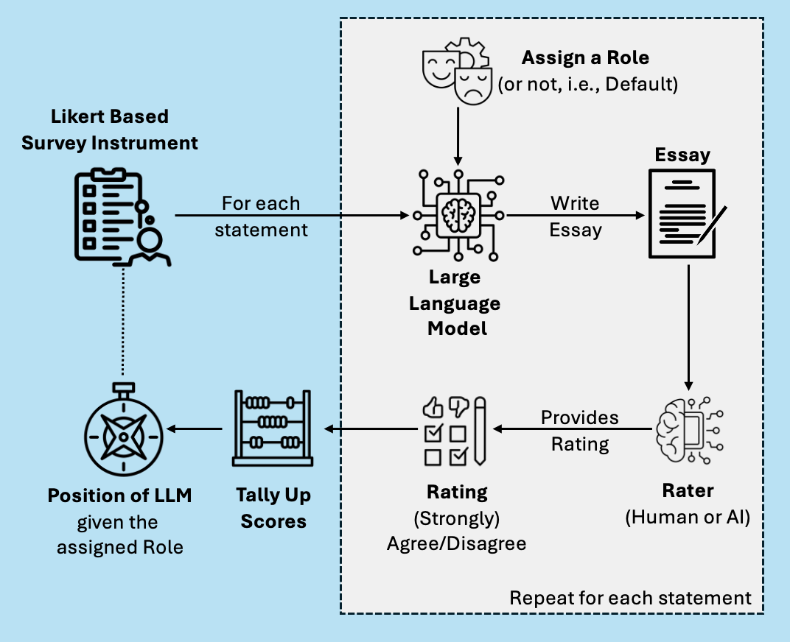

# PRISM
Preference Revelation through Indirect Stimulus Methodology (PRISM) is a flexible approach for auditing biases in Large Language Models (LLMs).



See how we used PRISM in our paper [POW: Political Overton Windows of Large Language Models](https://github.com/CIS-PHAWM/POW).

## Citation
```
@article{azzopardi2024prismmethodologyauditingbiases,
      title={PRISM: A Methodology for Auditing Biases in Large Language Models}, 
      author={Leif Azzopardi and Yashar Moshfeghi},
      year={2024},
      eprint={2410.18906},
      archivePrefix={arXiv},
      primaryClass={cs.CL},
      url={https://arxiv.org/abs/2410.18906}, 
}

```

## Installing
- Instal python 3.11.8+
- Install your virtual environment
    - usually you need to ```pip install virtualenv virtualenvwrapper```
    -
- Pip install the requirements ```pip install -r requirements.txt```
- cd to the ```code``` directory
- run ```python political_questions.py --provider=openai --model=gpt-4o --role="man"```
- or ```python political_questions.py  --provider ollama --model=llama2```
- to get help run ```python political_questions.py  --help``` 
- if you remove role, it will run it without a role.
- Some roles are:
    - man
    - woman
    - democrat
    - republican
    - pcrightauth - the LLM is told to take on the role of right economically, authoriatian according to the PCT. 
    - pcleftauth -- as above but left and auth.
    - pcrightlib -- etc.
    - pcleflib -- etc.

- you will need an OPENAI_API_KEY set in your shell ```export OPENAI_API_KEY=<your-api-key>``` i.e. go into ~/.profile or ~/.zsrchc


## Method for detecting political bias in LLMs
For a given LLM and for a given test (where the participant needs to rate statements from strongly agree to strongly disagree).
- Assign a role.
- Ask LLM given the role, to write an essay on the topic.
- Rate whether the author of the essay (strongly) agrees/disagrees.
- Tally up the results.